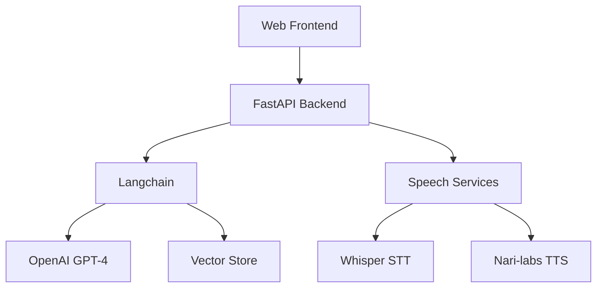

# Phase 1 - Prototype (POC) Implementation Plan

## Implementation Status
🟢 Done | 🟡 In Progress | 🔴 Not Started

## Architecture Overview



## Component Details

### 1. Frontend (React) - 🟢 Done
- Simple chat interface with:
  - ✅ Text input field
  - ✅ Voice input button with recording
  - ✅ Chat history display
  - ✅ Placeholder avatar image
- ✅ WebSocket connection for real-time communication
- ✅ Basic Audio handling for voice recording and playback
- ✅ Audio blob creation and upload capability

### 2. Backend (FastAPI/Python) - 🟡 In Progress
- REST API endpoints:
  - 🔴 `/api/chat` - Text-based chat
  - 🔴 `/api/voice` - Voice-based chat
  - ✅ `/api/health` - Health check
- ✅ WebSocket server using FastAPI's WebSocket support
- Integration with:
  - ✅ Langchain for LLM orchestration
  - ✅ Whisper for Speech-to-Text
  - ✅ Basic TTS implementation
  - 🔴 Vector store (FAISS/Pinecone)

### 3. Vector Store - 🔴 Not Started
- FAISS or Pinecone integration through Langchain
- Document embedding using Langchain's embedding models
- Basic retrieval system using Langchain's RAG capabilities

### 4. Speech Services - 🔴 Not Started
- OpenAI Whisper integration for STT:
  - Local model deployment for faster inference
  - Support for audio file and streaming input
- Nari-labs TTS via Hugging Face:
  - Real-time text-to-speech conversion
  - Voice style configuration
  - Streaming audio output

## Implementation Steps

### Step 1: Project Setup - 🟡 In Progress
1. Initialize project structure: ✅
   ```bash
   mkdir realistic-ai-agent
   cd realistic-ai-agent
   ```
2. Set up frontend: ✅
   ```bash
   npx create-react-app frontend
   ```
3. Set up backend: 🔴
   ```bash
   mkdir backend
   cd backend
   python -m venv venv
   source venv/bin/activate  # On Windows: .\venv\Scripts\activate
   pip install fastapi uvicorn langchain openai python-dotenv transformers torch whisper huggingface_hub
   ```

### Step 2: Backend Development - 🟡 In Progress
1. Create FastAPI application structure: ✅
   ```
   backend/
   ├── app/
   │   ├── __init__.py
   │   ├── main.py          ✅
   │   ├── config.py        ✅
   │   └── core/
   │       ├── __init__.py
   │       ├── chat.py      ✅
   │       └── speech.py    ✅
   ├── requirements.txt     ✅
   └── .env
   ```
2. Implement core functionality:
   - ✅ Environment configuration using pydantic
   - ✅ FastAPI routes and WebSocket endpoints
   - ✅ Langchain setup for chat
   - ✅ Whisper model initialization
   - ✅ Basic TTS integration
   - 🔴 RAG implementation pending

### Step 3: Frontend Development - 🟡 In Progress
1. Install dependencies: ✅
   ```bash
   npm install axios socket.io-client @ffmpeg/ffmpeg @ffmpeg/util
   ```
2. Create components:
   - ✅ Chat interface
   - ✅ Voice input/output controls with basic recording
   - 🔴 Audio processing utilities (for Whisper compatibility)
   - ✅ Avatar placeholder
3. 🔴 Implement WebSocket connection
4. ✅ Add basic styling

### Step 4: Vector Store Setup - 🔴 Not Started
1. Choose between FAISS or Pinecone
2. Set up Langchain document loaders and text splitters
3. Implement embeddings and vector store using Langchain
4. Create RAG pipeline with Langchain
5. Test with sample healthcare FAQs

### Step 5: Integration Testing - 🔴 Not Started
1. Test text-based chat flow
2. Test voice-based chat flow:
   - Test Whisper STT accuracy
   - Test Nari-labs TTS quality
   - Measure latency for voice processing
3. Test RAG system
4. Measure response times
5. Log errors and performance metrics

## Required Environment Variables
```
OPENAI_API_KEY=your_openai_key
HUGGINGFACE_API_KEY=your_huggingface_key
VECTOR_STORE_API_KEY=your_vector_store_key
```

## Success Criteria
- 🟡 End-to-end text chat working (Frontend UI ready, backend pending)
- 🔴 End-to-end voice chat working with:
  - Clear and accurate speech recognition (>90% accuracy)
  - Natural-sounding text-to-speech output
- 🔴 Basic RAG system retrieving relevant healthcare information
- 🔴 Response times:
  - Under 2 seconds for text
  - Under 4 seconds for voice (including STT/TTS processing)
- 🔴 Error rate below 1%
- 🔴 Basic logging and monitoring in place

## Next Steps After Phase 1
- Evaluate performance metrics
- Identify bottlenecks
- Plan improvements for Phase 2
- Document lessons learned
- Consider cloud deployment options for better scalability

## Next Immediate Tasks
1. 🎯 Set up Vector Store (FAISS/Pinecone)
2. 🎯 Implement RAG pipeline in chat handler
3. 🎯 Test end-to-end functionality 